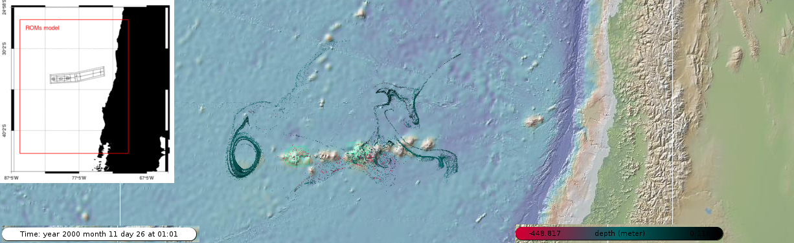

# 
# Pelagic connectivity between polygond in Atlantis

This code was create to generate the larval connectivity matrix between the diferent polygons inside Atlantis.

This code create the imput to use in [ICHTHYOP](http://www.ichthyop.org/) Ichthyop is a free Java tool designed to study the effects of physical and biological factors on ichthyoplankton dynamics. It incorporates the most important processes involved in fish early life: spawning, movement, growth, mortality and recruitment. The tool uses as input time series of velocity, temperature and salinity fields archived from ROMS, MARS, NEMO or SYMPHONIE oceanic models (either files or OpenDAP).

Also, the code Use the nc output from Ichtyops and create the Input For Atlantis.

This code still hardwired but can be modified easily
